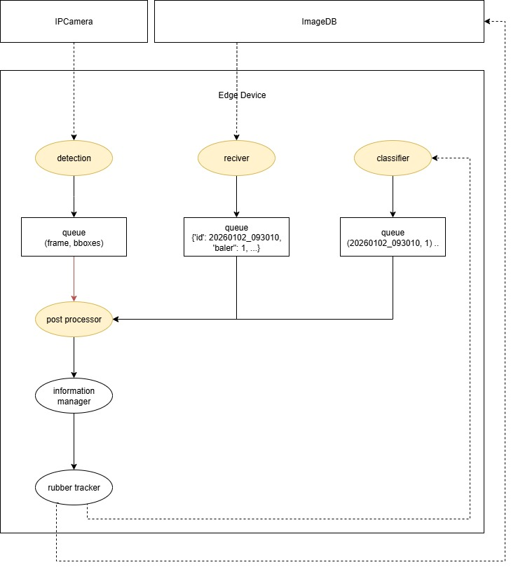
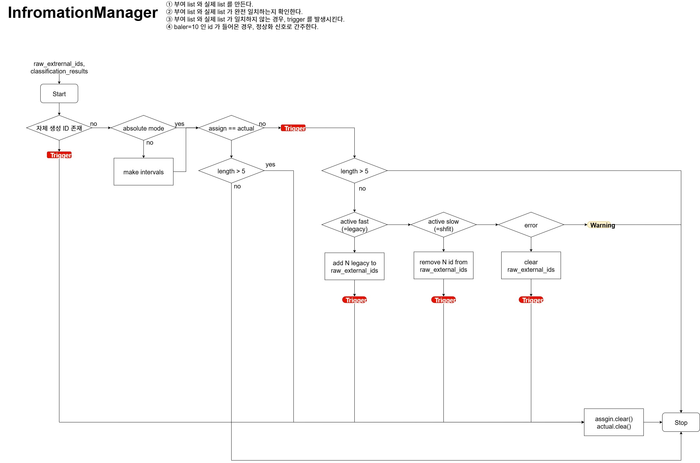
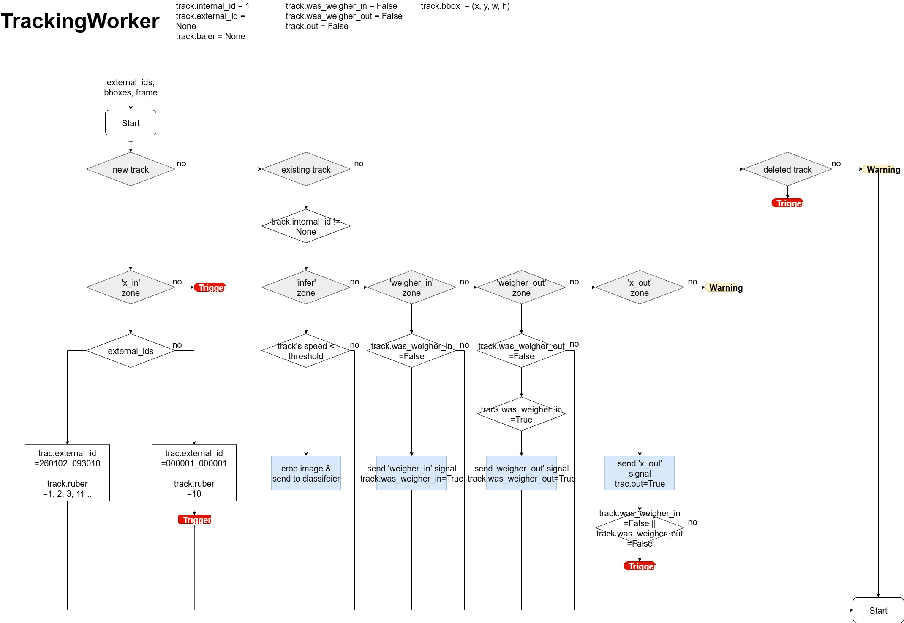

# Rubber Tracking System

## Overview
This project is a rubber tracking system designed to process camera input,
track objects, and manage tracking data through a structured workflow.
It integrates externally provided identifiers and maintains consistent tracking state across the system.

## System Architecture


## Core Components

### InformationManager
Manages tracking data (ID, baler, etc.) and validates synchronization.



### TrackingWorker
Handles the main tracking workflow, and forwards tracking results to other components.



## Project Structure
```
src/
├── main.py # Application entry point
│
├── classify/ # Classification logic
│ └── classifier.py
│
├── detect/ # Detection pipeline
│ ├── detector.py
│ └── hailo_apps_infra/ # Hailo + GStreamer integration
│
├── interfaces/ # External interfaces (video_source, network I/O)
│ ├── video
│ │ ├── source.py
│ │ └── packet.py
│ ├── receiver
│ │ ├── receiver.py
│ │ └── packet.py
│ └── sender
│   ├── sender.py
│   └── packet.py
│
└── rubber_tracking/ # Tracking core modules
  ├── information_manager.py
  ├── tracker.py
  └── tracking_worker.py
```